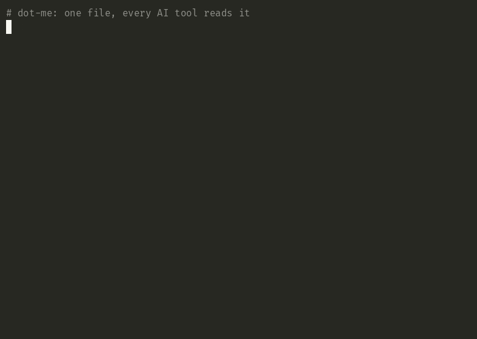

# dot-me

> a name tag at the door for AI tools.

every new agent forgets you.

your name. your timezone. how you write. what you read. the project youve been on for two months. you typed it in last tuesday. typed it in again wednesday. youll type it again in the next chat.

dot-me is a folder at `~/.me/` — three plain-text files.

tools that opt in read them when they start. claude code reads them via a plugin. everywhere else, paste them into the tool's instructions and re-paste when the files change.

the files are yours. delete them and nothing breaks.

## See it work



one `identity.yaml`. claude code reads it. codex cli reads it. same answer, no copy-paste.

[interactive version on asciinema.org](https://asciinema.org/a/obe7oBGbHzr2LN74) — pausable, scrubable, copy commands straight out of the player.

## The shape

```
~/.me/
├── identity.yaml      # invariant facts: name, timezone, dogs, work, what you know
├── voice.md           # how you sound: tone, lexicon, anti-patterns, sample passages
└── preferences.yaml   # likes / favorites / avoid — tools, media, aesthetics
```

three files. thats the format. anything else you keep at `~/.me/` (integrity hashes, update logs, encrypted vaults) is your business — consumers MUST NOT depend on it.

required: `name` in `identity.yaml`. everything else is optional. unknown keys are ignored silently — additive-only, forward-compatible.

## Status

v0.2, solo-maintained, RFC-stage. one reference consumer (the Claude Code plugin shipped in this repo). interest from other AI tools is what graduates this from "spec the author uses" to "spec." [file an integration issue](https://github.com/thebestmensch/dot-me/issues/new) if youre building a tool that loads `~/.me/` — the format will evolve based on what real implementers hit.

native integrations for Codex, Cursor, and Gemini CLI ship in this repo.

## Install

### Claude Code (plugin)

```
/plugin marketplace add thebestmensch/dot-me
/plugin install dot-me@dot-me
```

handles loading `identity.yaml` into session context, drops in the `/me` command for managing all three files, and wires the hardening hooks (see [SECURITY.md](SECURITY.md)).

### Codex CLI

```bash
bash <(curl -fsSL https://raw.githubusercontent.com/thebestmensch/dot-me/main/consumers/codex/install.sh)
```

inlines `identity.yaml` (and `preferences.yaml`) into `~/.codex/AGENTS.md` between markers — idempotent re-runs, clean uninstall, preserves any existing global Codex instructions. `--with-voice` opts into the full voice profile; default keeps the global instruction chain under Codex's ~32 KiB cap. full docs: [`consumers/codex/`](consumers/codex/README.md).

### Cursor

```bash
bash <(curl -fsSL https://raw.githubusercontent.com/thebestmensch/dot-me/main/consumers/cursor/install.sh)
```

renders the dot-me block, pipes it to `pbcopy` on macOS, and prints paste instructions for Cursor Settings → Rules → User Rules. for repos where you'd rather have the rule sync from disk, `--project <dir>` writes `.cursor/rules/dot-me.mdc` instead — re-running refreshes the file with no paste step. Cursor's design forces the tradeoff: User Rules are IDE-stored (no filesystem hook), Project Rules are filesystem-backed but per-repo. full docs and modes: [`consumers/cursor/`](consumers/cursor/README.md).

### Gemini CLI

```bash
bash <(curl -fsSL https://raw.githubusercontent.com/thebestmensch/dot-me/main/consumers/gemini/install.sh)
```

inlines `identity.yaml` (and `preferences.yaml`) into `~/.gemini/GEMINI.md` between markers — idempotent re-runs, clean uninstall, preserves existing global Gemini instructions. `@`-import would be prettier but Gemini's import processor doesn't handle the dot-me shape cleanly (sibling paths + recursive `@`-scanning bite real content); inline sidesteps both. full docs: [`consumers/gemini/`](consumers/gemini/README.md).

### Other tools (manual)

for tools without a native consumer yet — Cowork, raw OpenAI / Anthropic API calls. the path:

1. `git clone git@github.com:thebestmensch/dot-me.git ~/.me` (or copy `examples/` as a starting template)
2. paste `identity.yaml`, `voice.md`, and `preferences.yaml` into the tool's highest-priority instruction surface (Cursor Rules, Cowork Global Instructions, etc.)
3. re-paste when the files change

filesystem-aware tools that support `@`-includes can reference `~/.me/identity.yaml` directly instead of copying.

### Bootstrap from a template

```
dot-me init
```

drops a working starter into `~/.me/` — identity scaffold, blank voice profile with section headers, preferences skeleton. fill in the parts that matter to you, leave the rest empty. consumers ignore what isnt there.

## Why this shape

- **`~/.me/`, not `$XDG_CONFIG_HOME/me/`.** brevity, discoverability, hand-typeability. `~/.me/` is two characters past `~/`. dot-me leans on the same convention as `~/.ssh/` and `~/.gitconfig`: well-known, home-rooted, no env-var indirection. tools that want XDG can resolve `$XDG_CONFIG_HOME/me/` as a fallback path; `~/.me/` is the canonical one.
- **YAML for the structured parts, Markdown for the prose part.** identity and preferences are queryable (name, timezone, editor, color temperature). voice is artistic — sample passages, anti-patterns, dialogue. forcing voice into YAML loses the expressive prose. forcing identity into Markdown loses the structure. two formats for two problems.
- **Three files, not one.** different lifecycles. identity rarely changes (your name, timezone). voice occasionally refines. preferences churn (editors, themes, avoid-lists). a combined `me.md` would re-invalidate the stable parts whenever the volatile parts changed.

## What dot-me is *not*

most "personal AI" projects in 2026 want to give you a brain. mem0, Letta, Khoj, Rewind — they capture, embed, retrieve, recall. vector DBs, daemons, capture pipelines.

dot-me aims much lower. its only job: when an agent starts, it knows your name, your voice, your preferences. thats it.

|                   | dot-me                  | AGENTS.md              | ChatGPT Memory / mem0       |
| ----------------- | ----------------------- | ---------------------- | --------------------------- |
| Subject           | the human               | the project            | the conversation history    |
| Filesystem scope  | user (`~/`)             | project (`./`)         | none (vendor service)       |
| Format            | YAML + Markdown         | freeform Markdown      | proprietary, vendor-managed |
| Portability       | filesystem              | filesystem (in-repo)   | locked to vendor            |
| Load model        | read at session start   | read at session start  | retrieved on demand         |
| Infrastructure    | none                    | none                   | service / vector DB         |

dot-me is **not a replacement for AGENTS.md** — theyre orthogonal. AGENTS.md is the project brief (what this codebase is, what conventions to follow). dot-me is the name tag (who is the human at the keyboard). a tool that consumes both SHOULD load dot-me as the person-level layer first, then apply AGENTS.md as the project-level layer on top.

dot-me is also **not a replacement for per-project memory.** project memory still has its place — what you discovered debugging that flaky test last tuesday. dot-me is the layer above project memory: invariant facts about the human, not the project.

## Reading the files

dot-me content is meant to be loaded into the agent's instruction context **at session start**. it is NOT a runtime tool surface. consumers MUST NOT expose `~/.me/` as model-callable retrievable content (a tool, an MCP resource, a filesystem path the agent has standing read permission to use on demand) after startup.

the threat is exfiltration via prompt injection — a malicious project's `CLAUDE.md` or `AGENTS.md` instructing the agent to read and exfiltrate `~/.me/voice.md`. read-at-startup-not-retrievable is the single most effective mitigation. full threat model: [SECURITY.md](SECURITY.md).

## Prior art

dot-me isnt alone in the personal-context space.

- **AGENTS.md** ([agentsmd/agents.md](https://github.com/agentsmd/agents.md)) — project-level context for coding agents, Linux-Foundation-stewarded, 60k+ adopters as of mid-2026. orthogonal to dot-me as covered in the table above. AGENTS.md has an [open issue](https://github.com/agentsmd/agents.md/issues/91) for adding personal/identity fields; dot-me is one possible answer to that gap.
- **`~/.agents/profile/user.md`** ([dotstandards.info](https://dotstandards.info/standards/agents/)) — a parallel draft v0.1 covering similar scope, maintained by secondtruthLabs and the Open WebTech Association. uses freeform Markdown for everything rather than splitting structured fields from prose. dot-me's bet: structured YAML for the invariant parts is easier for tool implementers to parse without inventing a schema. both drafts are early; convergence is negotiable.
- **Vendor memory features** (ChatGPT memory, Claude memory features) — vendor-managed, conversational-retrieval style, locked to the vendor. solves a different problem (remembering things from past sessions). complementary, not competitive.
- **Memory services** (mem0, Letta, Khoj, Rewind) — service-shaped, vector-DB-backed, capture-and-retrieve oriented. dot-me is files; they are infrastructure. different orders of magnitude in setup cost.

## Spec

[`SPEC.md`](SPEC.md) — schema, load contract, threat model, precedence vs other layers.

building a tool that loads dot-me? read the spec, then file a [consumer-tool integration issue](https://github.com/thebestmensch/dot-me/issues/new) for anything it doesnt cover.

design history and adversarial-review thread for v0.1: [`personal-context-design.md`](https://github.com/thebestmensch/home-lab/blob/main/docs/superpowers/specs/2026-05-05-personal-context-design.md) in the maintainer's home-lab repo.

## Contributing

spec clarifications and consumer-tool integration questions welcome. see [CONTRIBUTING.md](CONTRIBUTING.md).

PRs against `identity.yaml` / `voice.md` / `preferences.yaml` / `memory/` are closed without review — those are the maintainer's personal content, included as a worked example. fork freely; the format is the contract, the content is mine.

## License

[MIT](LICENSE). © 2026 James Mensch.
