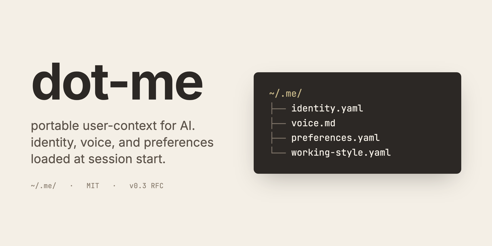

# dot-me



> the personal-context card AI tools read at the door: your name, your voice, your working agreement.

every new agent forgets you. twice.

it forgets who you are: your name, your timezone, the dogs, the project youve been on for two months. and it forgets how you want it to work with you: autonomous or check-in-heavy, terse or explanatory, the call you already made about scope discipline. you typed both in last tuesday. typed them again wednesday. youll type them again in the next chat.

dot-me is a folder at `~/.me/`: four plain-text files that name both layers.

- **identity**: your name tag at the door. `identity.yaml`.
- **working agreement**: how you want the AI to write and work with you. `voice.md` + `preferences.yaml` + `working-style.yaml`.

tools that opt in read them when they start. claude code reads them via a plugin. everywhere else, paste them into the tool's instructions and re-paste when the files change.

the files are yours. delete them and nothing breaks.

## See it work


one `identity.yaml`. claude code reads it. codex cli reads it. same answer, no copy-paste.

[interactive version on asciinema.org](https://asciinema.org/a/obe7oBGbHzr2LN74): pausable, scrubable, copy commands straight out of the player.

## The shape

```
~/.me/
├── identity.yaml       # invariant facts: name, timezone, dogs, work, what you know
├── voice.md            # how you sound: tone, lexicon, anti-patterns, sample passages
├── preferences.yaml    # likes / favorites / avoid (tools, media, aesthetics)
└── working-style.yaml  # how you want the AI to *work* with you (autonomy, scope, irreversibility)
```

four files. thats the format. anything else you keep at `~/.me/` (integrity hashes, update logs, encrypted vaults) is your business. consumers MUST NOT depend on it.

required: `name` in `identity.yaml`. everything else is optional. unknown keys are ignored silently. additive-only, forward-compatible.

**v0.4 adds an optional fifth thing that isnt a fifth file:** `voice.compact.md`, a ~30-line extract of `voice.md` that loads every session. the problem it fixes: `voice.md` is big, so consumers only load it when they notice the task is prose-shaped, and that noticing fails silently. you ask for a quick bio in a coding session, the agent has every fact about you and zero voice signal, the draft comes out corporate. the compact file keeps a voice floor in every session for ~2 KB, and points back to the full `voice.md` for real prose work. derived from `voice.md`, optional, not a core file (same status as the integrity hashes). details in [`SPEC.md`](SPEC.md) §5.2.1 + §6.1.

machine-readable JSON Schemas for `identity.yaml` and `preferences.yaml` live in [`spec/schema/`](spec/schema/) — tool implementers can validate user-supplied files against them. **Caveat:** the schema covers structural shape; the one strict spec invariant beyond `name` (`location.timezone` MUST be a real IANA zone) needs a runtime tzdata check on top, because most generic JSON Schema validators treat `format` as annotation-only. The bundled `spec/schema/validate-examples.py` does both checks — implementers wiring their own validator should layer a `zoneinfo` check (or equivalent) for the timezone field.

## Status

v0.4, solo-maintained, RFC-stage. four reference consumers ship in this repo: the Claude Code plugin (auto-loads `identity.yaml`, drops in `/me`; wiring the v0.4 voice floor is a recommended follow-up, not yet automated by the plugin bootstrap: add a `@~/.me/voice.compact.md` import to your `CLAUDE.md`), plus install scripts for Codex CLI, Cursor, and Gemini CLI. a Claude Cowork beta cohort is being invited now; until that loop closes, the maintainer dogfoods every surface against this content daily. [file an integration issue](https://github.com/thebestmensch/dot-me/issues/new) if youre building a tool that loads `~/.me/`. the format will evolve based on what real implementers hit.

friction reports welcome in [`feedback.md`](feedback.md) (PRs that just append are merged without ceremony) or as a [spec-clarification issue](https://github.com/thebestmensch/dot-me/issues/new). beta-cohort notes shape the next spec revision.

## Install

### Claude Code (plugin)

```
/plugin marketplace add thebestmensch/dot-me
/plugin install dot-me@dot-me
```

handles loading `identity.yaml` into session context, drops in the `/me` command for managing all four files, and wires the hardening hooks (see [SECURITY.md](SECURITY.md)).

> **Claude Cowork users**: the SessionStart hook doesnt fire in Cowork yet (upstream [anthropics/claude-code#16288](https://github.com/anthropics/claude-code/issues/16288)). after `/me init`, paste `~/.me/identity.yaml` into **Settings → Cowork → Global Instructions** and re-paste when the file changes. `/me show identity` renders the current content for copying. when the upstream bug is fixed, the hook starts firing automatically with no install changes.

### Codex CLI

```bash
bash <(curl -fsSL https://raw.githubusercontent.com/thebestmensch/dot-me/main/consumers/codex/install.sh)
```

inlines `identity.yaml` (and `preferences.yaml`) into `~/.codex/AGENTS.md` between markers (idempotent re-runs, clean uninstall, preserves any existing global Codex instructions). `--with-voice` opts into the full voice profile; default keeps the global instruction chain under Codex's ~32 KiB cap. full docs: [`consumers/codex/`](consumers/codex/README.md).

### Cursor

```bash
bash <(curl -fsSL https://raw.githubusercontent.com/thebestmensch/dot-me/main/consumers/cursor/install.sh)
```

renders the dot-me block, pipes it to `pbcopy` on macOS, and prints paste instructions for Cursor Settings → Rules → User Rules. for repos where you'd rather have the rule sync from disk, `--project <dir>` writes `.cursor/rules/dot-me.mdc` instead. re-running refreshes the file with no paste step. Cursor's design forces the tradeoff: User Rules are IDE-stored (no filesystem hook), Project Rules are filesystem-backed but per-repo. full docs and modes: [`consumers/cursor/`](consumers/cursor/README.md).

### Gemini CLI

```bash
bash <(curl -fsSL https://raw.githubusercontent.com/thebestmensch/dot-me/main/consumers/gemini/install.sh)
```

inlines `identity.yaml` (and `preferences.yaml`) into `~/.gemini/GEMINI.md` between markers (idempotent re-runs, clean uninstall, preserves existing global Gemini instructions). `@`-import would be prettier but Gemini's import processor doesn't handle the dot-me shape cleanly (sibling paths + recursive `@`-scanning bite real content); inline sidesteps both. full docs: [`consumers/gemini/`](consumers/gemini/README.md).

### Other tools (manual)

for tools without a native consumer yet (Cowork, raw OpenAI / Anthropic API calls), the path:

1. `git clone https://github.com/thebestmensch/dot-me.git ~/.me` (or copy `examples/` as a starting template)
2. paste `identity.yaml`, `voice.md`, `preferences.yaml`, and `working-style.yaml` into the tool's highest-priority instruction surface (Cursor Rules, Cowork Global Instructions, etc.)
3. re-paste when the files change

filesystem-aware tools that support `@`-includes can reference `~/.me/identity.yaml` directly instead of copying.

### Bootstrap from a template

```
/me init
```

run inside Claude Code after installing the plugin above. drops a working starter into `~/.me/`: identity scaffold, blank voice profile with section headers, preferences skeleton, and a working-style file with the recommended dimensions. fill in the parts that matter to you, leave the rest empty. consumers ignore what isnt there.

no standalone `dot-me` CLI ships today — `/me init` is the only bootstrap path. without Claude Code, follow [Other tools (manual)](#other-tools-manual) above and copy `examples/` by hand.

## Why this shape

- **`~/.me/`, not `$XDG_CONFIG_HOME/me/`.** brevity, discoverability, hand-typeability. `~/.me/` is two characters past `~/`. dot-me leans on the same convention as `~/.ssh/` and `~/.gitconfig`: well-known, home-rooted, no env-var indirection. tools that want XDG can resolve `$XDG_CONFIG_HOME/me/` as a fallback path; `~/.me/` is the canonical one.
- **YAML for the structured parts, Markdown for the prose part.** identity and preferences are queryable (name, timezone, editor, color temperature). voice is artistic: sample passages, anti-patterns, dialogue. forcing voice into YAML loses the expressive prose. forcing identity into Markdown loses the structure. two formats for two problems.
- **Four files, not one.** different lifecycles. identity rarely changes (your name, timezone). voice occasionally refines. working-style occasionally refines as you learn what autonomy level you actually want. preferences churn (editors, themes, avoid-lists). a combined `me.md` would re-invalidate the stable parts whenever the volatile parts changed.

## What dot-me is *not*

most "personal AI" projects in 2026 want to give you a brain. mem0, Letta, Khoj, Rewind. they capture, embed, retrieve, recall. vector DBs, daemons, capture pipelines.

dot-me aims much lower. its only job: when an agent starts, it knows your name, your voice, your preferences, and how you want it to work with you. thats it.

|                   | dot-me                          | AGENTS.md (project)    | Cursor rules (project)     | `~/.codex/AGENTS.md` (user) | ChatGPT Memory / mem0       |
| ----------------- | ------------------------------- | ---------------------- | -------------------------- | --------------------------- | --------------------------- |
| Subject           | the human (identity + agreement)| the project            | the project                | the human (Codex-only)      | the conversation history    |
| Filesystem scope  | user (`~/`)                     | project (`./`)         | project (`.cursor/rules/`) | user (`~/.codex/`)          | none (vendor service)       |
| Format            | YAML + Markdown                 | freeform Markdown      | `.mdc` (front-matter + MD) | freeform Markdown           | proprietary, vendor-managed |
| Cross-vendor      | yes (filesystem + consumers)    | yes (multi-tool)       | no (Cursor-only)           | no (Codex-only)             | no (vendor-locked)          |
| Load model        | read at session start           | read at session start  | scope-on-glob, `alwaysApply` | read at session start       | retrieved on demand         |
| Infrastructure    | none                            | none                   | none                       | none                        | service / vector DB         |

the user-level cross-vendor cell is what dot-me claims. Codex's `~/.codex/AGENTS.md` is the closest analog but ships with Codex only.

dot-me is **not a replacement for AGENTS.md**. theyre orthogonal. AGENTS.md is the project brief (what this codebase is, what conventions to follow). dot-me is who the human is and how they want the AI to work with them. a tool that consumes both SHOULD load dot-me as the person-level layer first, then apply AGENTS.md as the project-level layer on top.

dot-me is also **not a replacement for per-project memory.** project memory still has its place: what you discovered debugging that flaky test last tuesday. dot-me is the layer above project memory: invariant facts about the human, not the project.

## Reading the files

dot-me content is meant to be loaded into the agent's instruction context **at session start**. it is NOT a runtime tool surface. consumers MUST NOT expose `~/.me/` as model-callable retrievable content (a tool, an MCP resource, a filesystem path the agent has standing read permission to use on demand) after startup.

the threat is exfiltration via prompt injection: a malicious project's `CLAUDE.md` or `AGENTS.md` instructing the agent to read and exfiltrate `~/.me/voice.md`. read-at-startup-not-retrievable is the single most effective mitigation. full threat model: [SECURITY.md](SECURITY.md).

## Prior art

dot-me isnt alone in the personal-context space.

- **AGENTS.md** ([agentsmd/agents.md](https://github.com/agentsmd/agents.md)): project-level context for coding agents, Linux-Foundation-stewarded, 60k+ adopters as of mid-2026. orthogonal to dot-me as covered in the table above. AGENTS.md has an [open issue](https://github.com/agentsmd/agents.md/issues/91) for adding personal/identity fields; dot-me is one possible answer to that gap.
- **`~/.agents/profile/user.md`** ([dotstandards.info](https://dotstandards.info/standards/agents/)): a parallel draft v0.1 covering similar scope, maintained by secondtruthLabs and the Open WebTech Association. uses freeform Markdown for everything rather than splitting structured fields from prose. dot-me's bet: structured YAML for the invariant parts is easier for tool implementers to parse without inventing a schema. both drafts are early; convergence is negotiable.
- **Vendor memory features** (ChatGPT memory, Claude memory features): vendor-managed, conversational-retrieval style, locked to the vendor. solves a different problem (remembering things from past sessions). complementary, not competitive.
- **Memory services** (mem0, Letta, Khoj, Rewind): service-shaped, vector-DB-backed, capture-and-retrieve oriented. dot-me is files, they are infrastructure. different orders of magnitude in setup cost.

## Spec

[`SPEC.md`](SPEC.md): schema, load contract, threat model, precedence vs other layers.

building a tool that loads dot-me? read the spec, then file a [consumer-tool integration issue](https://github.com/thebestmensch/dot-me/issues/new) for anything it doesnt cover.

design history and adversarial-review thread for v0.1: [`personal-context-design.md`](https://github.com/thebestmensch/home-lab/blob/main/docs/superpowers/specs/2026-05-05-personal-context-design.md) in the maintainer's home-lab repo.

## Contributing

spec clarifications and consumer-tool integration questions welcome. see [CONTRIBUTING.md](CONTRIBUTING.md).

PRs against `identity.yaml` / `voice.md` / `preferences.yaml` / `working-style.yaml` / `memory/` are closed without review. those are the maintainer's personal content, included as a worked example. fork freely; the format is the contract, the content is mine.

## License

[MIT](LICENSE). © 2026 James Mensch.
